<p align="center">
  
</p>


<h1 align="center">GemMate</h1>

<p align="center">
  <strong>あなたのAI学習パートナー — Gemma 4搭載</strong>
</p>

<p align="center">
  <a href="#機能">機能</a> •
  <a href="#アーキテクチャ">アーキテクチャ</a> •
  <a href="#デモ">デモ</a> •
  <a href="#インストール">インストール</a> •
  <a href="#技術スタック">技術スタック</a> •
  <a href="#ライセンス">ライセンス</a>
</p>
<p align="center">
  
  
  
  
  
</p>
<p align="center">
  
  
  
</p>


---

## 🌟 GemMateとは？

GemMateは、**GoogleのGemma 4 E2B**モデルと実証済みの学習科学技術を組み合わせることで、大学生の学習方法を一変させます。これは、Gemma 4を**100%ローカル**で実行するクロスプラットフォームのFlutterアプリです。クラウドもAPIキーも不要で、データがデバイス外に出ることはありません。

> 💡 **課題:** 学生は講義や教科書から効果的な学習教材を作成するのに苦労しています。既存のAIツールはクラウド接続が必要で、プライバシー上の懸念があります。
>
> ✅ **解決策:** GemMateはGemma 4 E2Bを独自のハードウェアで実行し、パーソナライズされた単語カード、クイズ、解説を生成します。飛行機の中でも使用可能です。

<p align="center">   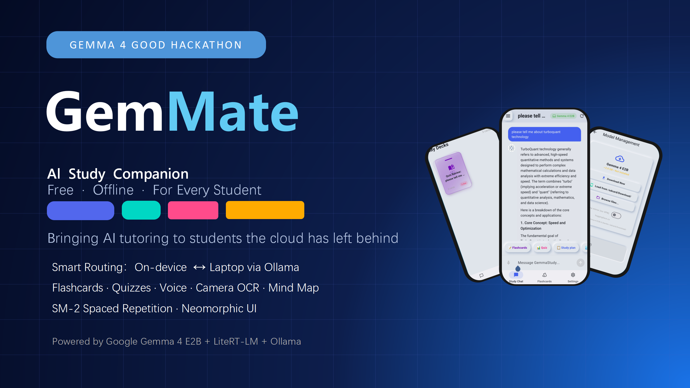 </p>

---

## ✨ 機能

### 🧠 Gemma 4によるAIチャット
Gemma 4 E2Bとチャットして、複雑な概念を理解しましょう。サポートされている6つの言語のいずれかで質問すると、あなたのレベルに合わせたバイリンガルの解説が得られます。

<p align="center">   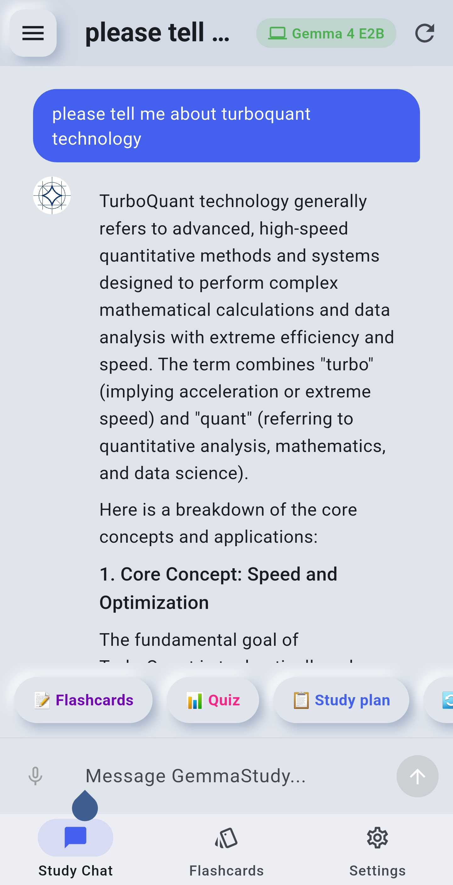 </p>

### 📚 スマートな単語カードデッキ
チャットの会話から単語カードデッキを生成します。カードは科学的に最適化された復習スケジュールを実現する**SM-2間隔反復アルゴリズム**を使用しています。デッキは、フリップアニメーション付きの美しい扇形のカードパイルとして表示されます。

<div align="center">
  <table>
    <tr>
      <td align="center"><b>表面</b></td>
      <td align="center"><b>裏面</b></td>
    </tr>
    <tr>
      <td align="center">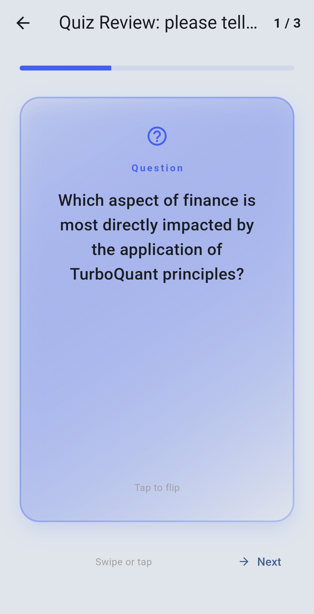</td>
      <td align="center">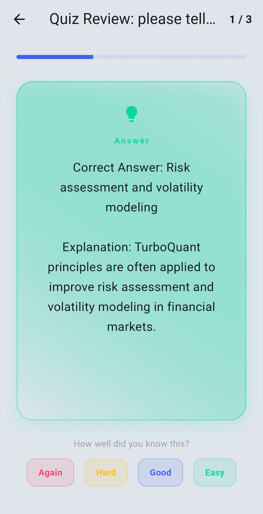</td>
    </tr>
  </table>
</div>

### 📊 インタラクティブなクイズ
理解度をテストするAI生成の選択式クイズです。間違えた回答は自動的に単語カードになり、集中的に復習できます。

<p align="center">   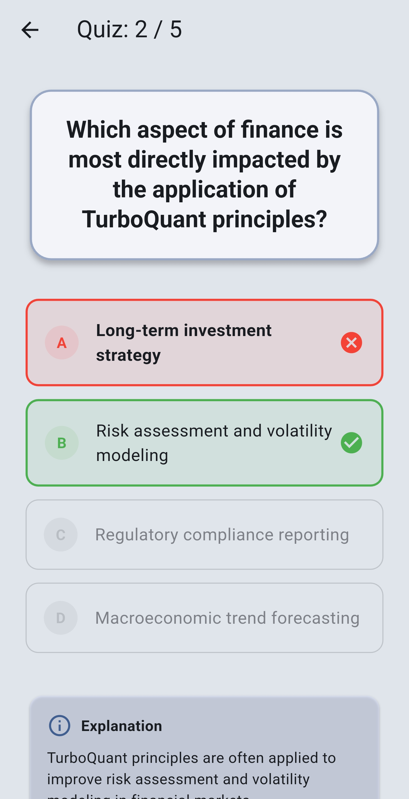   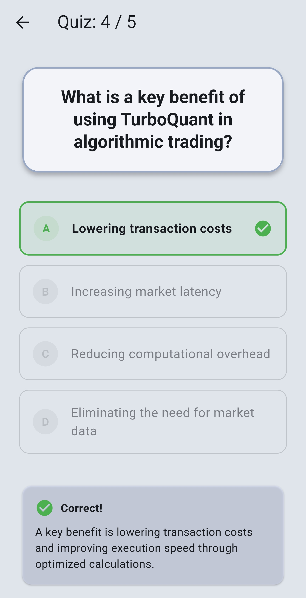   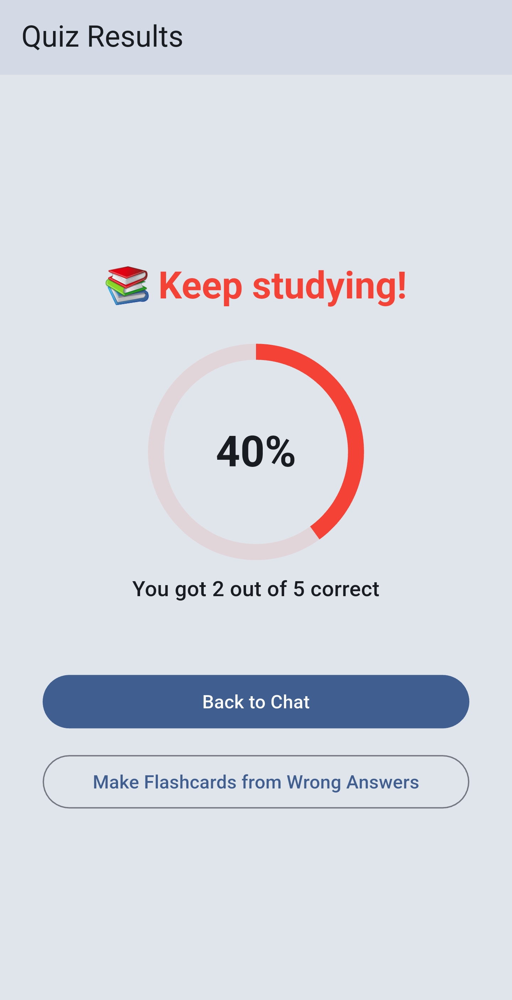 </p>

### 📷 カメラ / 文字認識
教科書のページ、講義のスライド、手書きのノートを撮影します。Gemma 4のビジョン機能が内容を抽出して解説します。

<p align="center">   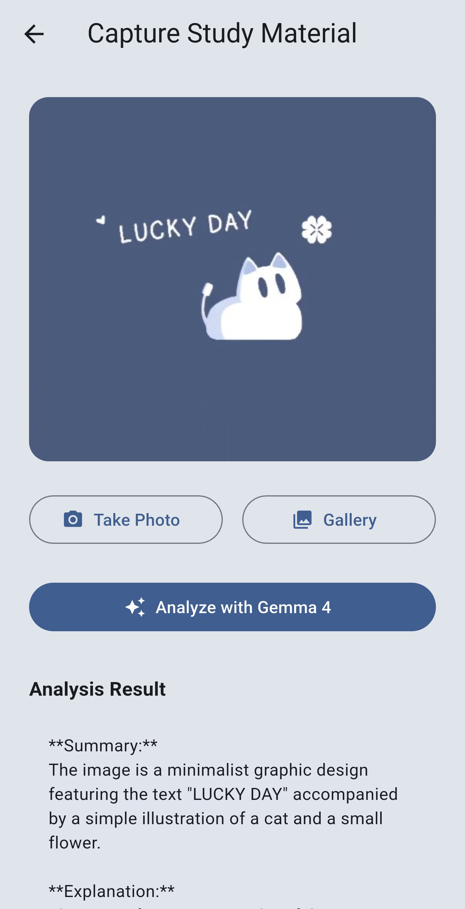 </p>

### 🎤 音声入力
マイクをタップして音声で質問できます。ハンズフリー学習に最適です。日本語、中国語、英語、韓国語、フランス語、スペイン語をサポートしています。

<p align="center">   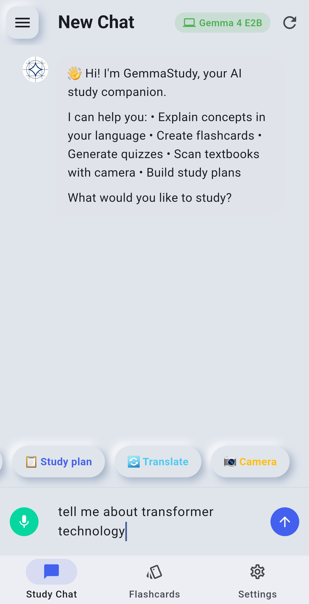 </p>

### 🌍 6つの言語
以下の言語での完全なUIローカライズとAIレスポンスに対応しています：日本語、英語、简体中文、한국어、Français、Español。

<p align="center">   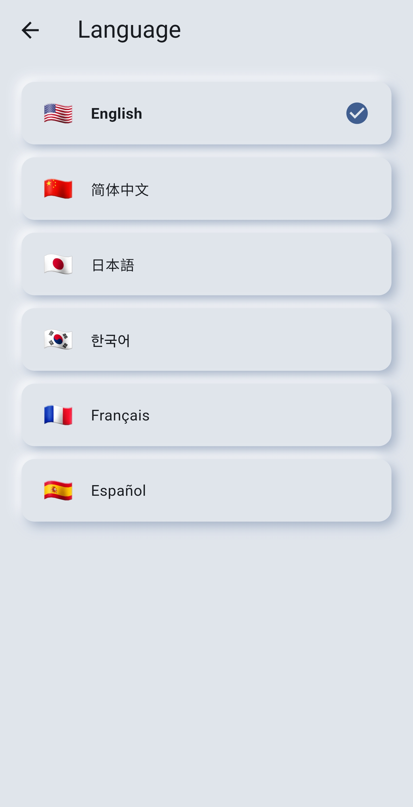 </p>

### 🔔 スマート通知
間隔反復のリマインダー、毎日の学習プロンプト、アクティビティのないときのお知らせにより、学習を継続させます。

<p align="center">   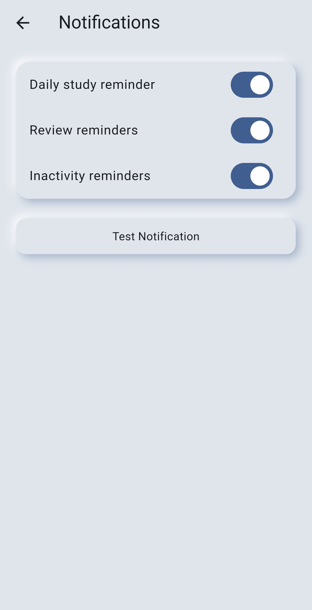 </p>

### 🗺️ AIマインドマップ生成器
ワンタップで会話から視覚的に色分けされたマインドマップを生成します。ベジェ曲線で描画され、インタラクティブなパン/ズームが可能なキャンバスを備えています。試験前の複雑なトピックの整理に最適です。

<p align="center">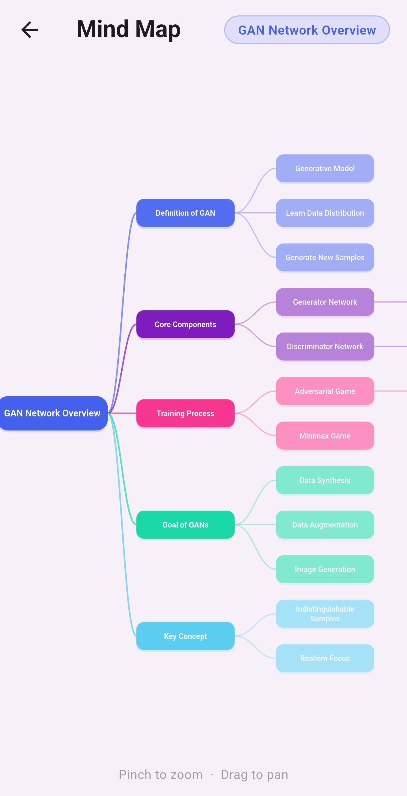</p>

### 📄 ドキュメントインポート (PDF + DOCX)
PDFやWord (.docx) ファイルをチャットに直接インポートします。GemMateがテキストを抽出してAIに送るため、あらゆるドキュメントから質問、単語カード生成、要約取得が可能です。クラウドへのアップロードは不要です。

<p align="center"></p>

### 📷 カメラ数学解答
カメラ画面を**数学解答**モードに切り替えて、手書きの数式や印刷された問題を撮影します。AIがステップごとに解法を提示し、各ステップを練習用の単語カードとして保存できます。

<div align="center">
  <table>
    <tr>
      <td align="center"><b>モード選択</b></td>
      <td align="center"><b>分析中</b></td>
      <td align="center"><b>ステップ解法結果</b></td>
    </tr>
    <tr>
      <td align="center"></td>
      <td align="center"></td>
      <td align="center"></td>
    </tr>
  </table>
</div>

### 🔲 QRコード共有とギャラリースキャン
生成されたQRコードで単語カードデッキをクラスメートと共有したり、ギャラリーの画像からQRをスキャンしたりできます。カメラをスクリーンに向ける必要はありません。

<div align="center">
  <table>
    <tr>
      <td align="center"><b>スキャンインターフェース</b></td>
      <td align="center"><b>QRコードで共有</b></td>
    </tr>
    <tr>
      <td align="center"></td>
      <td align="center"></td>
    </tr>
  </table>
</div>

### 🍅 カスタムポモドーロタイマー
ホーム画面から直接、独自の集中時間と休憩時間（1–120分 / 1–60分）を設定できます。数値を入力するか、+/−をタップして操作します。セッションは毎日記録され、ローカルに保存されます。

<div align="center">
  <table>
    <tr>
      <td align="center"><b>タイマー</b></td>
      <td align="center"><b>カスタム設定</b></td>
    </tr>
    <tr>
      <td align="center"></td>
      <td align="center"></td>
    </tr>
  </table>
</div>

### 🎨 ニューモーフィズムデザイン
ダーク/ライトモード、カスタマイズ可能なアクセントカラー、調整可能なフォントサイズを備えた美しいニューモーフィズムUIです。

<p align="center">   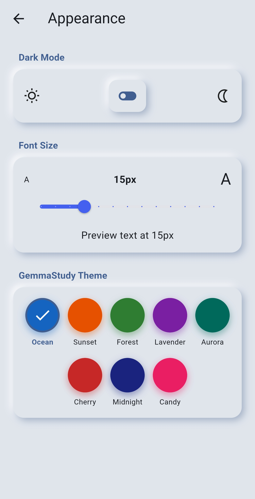 </p>

---

## 🏗️ アーキテクチャ

GemMateは、利用可能な最適なAIモデルを自動的に選択する**スマートルーティングアーキテクチャ**を使用しています。

```
┌─────────────────────────────────────────────────┐
│                📱 スマートフォン                 │
│             GemMate Flutterアプリ                │
│                                                 │
│  ┌──────────┐  ┌──────────┐  ┌──────────┐       │
│  │ チャット │  │ カード   │  │ クイズ   │       │
│  └────┬─────┘  └────┬─────┘  └────┬─────┘       │
│       │              │              │           │
│       └──────────────┼──────────────┘           │
│                      │                          │
│              ┌───────▼────────┐                 │
│              │スマートルーター  │                 │
│              └───┬───────┬─-──┘                 │
│                  │       │                      │
│     ┌────────────▼─┐  ┌──▼───────────────┐      │
│     │ デバイス内   │  │   Ollama HTTP    │      │
│     │ Gemma 4 E2B  │  │      接続        │      │
│     │（オフライン）│  │ (WiFiローカル網)  │      │
│     └──────────────┘  └──────┬───────────┘      │
│                              │                  │
└──────────────────────────────┼──────────────────┘
                               │ WiFi (ローカルネットワーク)
┌──────────────────────────────▼───────────────────┐
│                💻 ノートPC                       │
│           Ollama + Gemma 4 E4B                   │
│         (RTX 4060, 1秒未満の応答)                │
└──────────────────────────────────────────────────┘
```

### スマートルーティングロジック

| 条件 | 使用モデル | 遅延 |
|-----------|-----------|---------|
| WiFi + ノートPCが利用可能 | Ollama経由のGemma 4 E4B (ノートPC GPU) | <1s |
| WiFiなし、モデルインストール済み | デバイス内のGemma 4 E2B (スマホ CPU) | 3-8s |
| WiFiあり + ノートPCなし | デバイス内のGemma 4 E2B | 3-8s |
| WiFiなし、モデルなし | モデルのダウンロードを促す | — |

---

## 🎬 デモ

📺 **[3分間のデモビデオを見る →](https://youtu.be/tLnDOzBy_Kc)**

📦 **[APKをダウンロード →](https://github.com/linyeping/GemMate/releases/latest)**

---

## 🚀 インストール

### 前提条件

- Flutter 3.41+ ([Flutterのインストール](https://flutter.dev/docs/get-started/install))
- Androidデバイス (Android 8.0+) またはエミュレータ
- ノートPC AI用: [Ollama](https://ollama.ai) + `ollama pull gemma4:e2b`

### ソースからビルド

```bash
# リポジトリをクローン
git clone https://github.com/linyeping/GemMate.git
cd GemMate

# 依存関係をインストール
flutter pub get

# 接続されたデバイスで実行
flutter run

# APKをビルド
flutter build apk --release
```

### ノートPC AIのセットアップ (任意、推奨)

```bash
# Ollamaをインストール (https://ollama.ai)
ollama pull gemma4:e2b

# ネットワークアクセスを有効にして起動
OLLAMA_HOST=0.0.0.0:11434 ollama serve

# GemMateの設定 → 接続 → ノートPCのIPを入力
```

### デバイス内モデルのインストール (任意、オフライン用)

方法 A: アプリ内でダウンロード (設定 → モデル管理 → ダウンロード)

方法 B: ADB経由で手動インストール:
```bash
# Hugging Faceミラー (中国) からダウンロード
curl -L -o gemma-4-E2B-it.litertlm "https://hf-mirror.com/litert-community/gemma-4-E2B-it-litert-lm/resolve/main/gemma-4-E2B-it.litertlm"

# スマホにプッシュ
adb push gemma-4-E2B-it.litertlm /sdcard/Download/

# アプリ内: 設定 → モデル管理 → /sdcard/Download/ から読み込み
```

---

## 🛠️ 技術スタック

| コンポーネント | テクノロジー |
|-----------|-----------|
| **AIモデル** | Gemma 4 E2B / Gemma 4 E4B |
| **デバイス内ランタイム** | flutter_gemma経由のLiteRT-LM |
| **ローカルサーバー** | Ollama (ノートPC, GPU加速) |
| **アプリフレームワーク** | Flutter 3.41 / Dart |
| **学習アルゴリズム** | SM-2間隔反復 |
| **音声入力** | speech_to_text |
| **文字認識 / ビジョン** | ML Kit (オフライン) + Gemma 4 マルチモーダル (Ollama) |
| **QRコード** | mobile_scanner 5.x |
| **ドキュメントインポート** | pdfx + archive (DOCX ZIP/XML解析) |
| **マインドマップ** | CustomPainter + InteractiveViewer |
| **通知** | flutter_local_notifications |
| **ストレージ** | SharedPreferences + JSON |
| **UIデザイン** | カスタムニューモーフィズムウィジェット |

---

## 📁 プロジェクト構造

```
lib/
├── main.dart                          # アプリのエントリポイント + モデル初期化
├── app/
│   ├── router.dart                    # ボトムナビゲーション + ページルーティング
│   └── theme.dart                     # ニューモーフィズムテーマ (ライト/ダーク)
├── core/
│   ├── constants.dart                 # アプリ定数 + カラー
│   ├── json_utils.dart                # JSON解析ユーティリティ
│   ├── text_utils.dart                # テキスト処理とフォーマット
│   └── utils.dart                     # 汎用ヘルパー関数
├── l10n/
│   ├── app_localizations.dart         # 国際化デリゲート
│   ├── locale_en.dart                 # 英語ローカライズ
│   ├── locale_es.dart                 # スペイン語ローカライズ
│   ├── locale_fr.dart                 # フランス語ローカライズ
│   ├── locale_ja.dart                 # 日本語ローカライズ
│   ├── locale_ko.dart                 # 韓国語ローカライズ
│   └── locale_zh.dart                 # 中国語ローカライズ
├── models/
│   ├── chat_message.dart              # チャットメッセージモデル
│   ├── chat_session.dart              # チャットセッションモデル
│   ├── flashcard.dart                 # SM-2フィールド + グループ化付き単語カード
│   ├── quiz.dart                      # クイズ状態モデル
│   ├── quiz_question.dart             # クイズ問題モデル
│   ├── quiz_result.dart               # 完了したクイズの概要とスコア
│   └── study_plan.dart                # 間隔反復スケジュールモデル
├── screens/
│   ├── capture_screen.dart            # カメラ / 文字認識 + 数学解答モード
│   ├── chat_history_screen.dart       # チャットセッション管理
│   ├── chat_screen.dart               # メインチャットUI + 音声 + マインドマップ + ドキュメントインポート
│   ├── deck_study_screen.dart         # カードフリップ学習セッション
│   ├── exam_history_screen.dart       # 過去の試験記録
│   ├── exam_screen.dart               # 時間制限付き試験モード
│   ├── flashcard_screen.dart          # 扇形パイル付きデッキギャラリー
│   ├── home_screen.dart               # ダッシュボード + カスタムポモドーロタイマー
│   ├── mind_map_screen.dart           # AI生成のインタラクティブなマインドマップ
│   ├── onboarding_screen.dart         # 初回起動セットアップ + モデルダウンロード
│   ├── paper_screen.dart              # 学習ペーパーの詳細表示とエクスポート
│   ├── qr_scan_screen.dart            # QRスキャン (カメラ + ギャラリー)
│   ├── qr_share_screen.dart           # デッキ用QRコード共有
│   ├── quiz_screen.dart               # インタラクティブなクイズUI
│   ├── review_screen.dart             # スケジュールされた復習ダッシュボード
│   └── settings_screen.dart           # サブページ付き設定
├── services/
│   ├── flashcard_generator.dart       # AI駆動の単語カード作成
│   ├── local_gemma_service.dart       # flutter_gemma経由のデバイス内Gemma 4
│   ├── model_download_service.dart    # モデルダウンロード + ミラーサポート
│   ├── notification_service.dart      # 学習リマインダー
│   ├── ollama_service.dart            # Ollama API用HTTPクライアント
│   ├── pdf_service.dart               # PDF + DOCXインポートとテキスト抽出
│   ├── quiz_generator.dart            # AI駆動のクイズ生成
│   ├── smart_router.dart              # スマートモデル選択 + システムオーバーライド
│   ├── storage_service.dart           # ローカルファイル/DBストレージ操作
│   ├── streak_service.dart            # 毎日の継続 + ポモドーロカウンター
│   └── study_tools.dart               # コア学習アルゴリズム (SM-2など)
├── stores/
│   ├── chat_store.dart                # チャットセッション永続化
│   ├── connection_store.dart          # 接続状態管理
│   ├── flashcard_store.dart           # 単語カード永続化 + グループ
│   ├── locale_store.dart              # 言語設定
│   └── theme_store.dart               # テーマ + フォントサイズ設定
└── widgets/
    ├── animated_avatar.dart           # AI/ユーザーのアニメーションプロフィール画像
    ├── chat_session_tile.dart         # チャット履歴リスト項目
    ├── code_block.dart                # シンタックスハイライト付きコード表示
    ├── color_scheme_picker.dart       # テーマカラーセレクター
    ├── connection_indicator.dart      # 接続ステータスピル
    ├── download_progress_widget.dart  # モデルダウンロードステータスUI
    ├── flashcard_widget.dart          # 個別単語カードUI
    ├── loading_indicator.dart         # カスタム読み込みアニメーション
    ├── message_bubble.dart            # チャットメッセージバブル
    ├── model_badge.dart               # モデルソースインジケーター (Edge/Laptop)
    ├── neumorphic_button.dart         # ニューモーフィズムボタンウィジェット
    ├── neumorphic_container.dart      # ニューモーフィズムカードウィジェット
    ├── quick_action_chips.dart        # 推奨プロンプトチップ
    └── quiz_option_tile.dart          # クイズ選択肢ボタン
```

---

## 👤 開発者について

**Sheng Wei & Lin Yeping** — 中国の**甘肃政法大学 (GSUPL)**でAIを専攻。

過去のプロジェクト: **InSeeVision** (Gemma 3 アクセシビリティプロジェクト)。

- GitHub: [@linyeping](https://github.com/linyeping)
- Kaggle: [linyeping](https://kaggle.com/linyeping)

---

## 📄 ライセンス

このプロジェクトはApache License 2.0の下でライセンスされています。詳細は[LICENSE](LICENSE)ファイルをご覧ください。

Gemma 4モデルは、Googleから[Gemma利用規約](https://ai.google.dev/gemma/terms)に基づいて提供されています。

---

<p align="center">
  <strong>Gemma 4 Good Hackathon 2026のために心を込めて制作 ❤️</strong><br/>
  <strong>連絡先: yepinglin20@gmail.com | 201180946@qq.com</strong>
</p>
